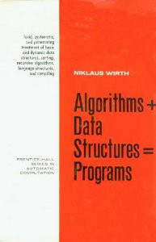

# The Best Programming Book Ever Written

This project is a living, runnable exploration of Niklaus Wirth's classic book:  
[**"Algorithms + Data Structures = Programs"**](https://www.amazon.com/Algorithms-Structures-Prentice-Hall-Automatic-Computation/dp/0130224189) — arguably the most elegant and timeless programming book ever written.

## 📚 Backstory

In 2013, while taking an Algorithms course at Portland State University the professor [Dr. Herbert Mayer](https://de.wikipedia.org/wiki/Herbert_G._Mayer), a very respected/accomplished professor lifted this book and in his thick German accent said *"dis est de best programming book ever vritten."*; which I thought was incredible because 1) he just brought in the book in to show it off, it wasnt course material and 2) considering the [books that he wrote himself](https://www.amazon.com/Computers-Technology-Herbert-Mayer-Books/s?rh=n%3A5%2Cp_27%3AHerbert%2BMayer) figured it must of been good. I bought the book immediately, saw it was in Pascal, and closed immediately 😂😂😂. Pascal is somewhat of a barrier obviosly to completely digesting the material; and obviously Pascal isnt the most lucrative language to pick up. That aside, I've always wanted to dig into. So here we are. 

<div align="center">
  
</div>


[Niklaus Wirth](https://en.wikipedia.org/wiki/Niklaus_Wirth) (the creator of Pascal, Modula, and Oberon) wrote this book in 1976. It teaches programming by connecting algorithms and data structures directly — not as separate topics — but as co-dependent parts of programs. This idea still shapes modern programming languages and pedagogy today.

While the original examples are written in **Pascal**, this project translates many of them into **Python**, **C++**, and **Go**, giving learners a cross-language view of core ideas.

---

## 🧠 What's In Here

- 📂 `chapters/`  
  Contains categorized examples by chapter, from sorting to recursive algorithms.

- 📂 `exercises/`  
  Hands-on Pascal exercises with stubbed code meant to be filled in (great for beginners or students).

Each code example is mirrored in:
- Pascal (original)
- Python (clear, modern syntax)
- C++ (for performance-minded or systems learners)
- Go (strong typing + modern structure)

---

## 🚀 How to Run

### Requirements:
- [Docker](https://www.docker.com/)
- [Docker Compose](https://docs.docker.com/compose/)

### 1. Clone this repo

```bash
git clone https://github.com/yourname/the-best-programming-book-ever-written.git
cd the-best-programming-book-ever-written
```

### 2. Build the environment

```bash
docker-compose build
```

### 3. Launch the dev container

```bash
./dev.sh
```

This drops you into a terminal **inside the container**, with all tools ready:
- Free Pascal Compiler (fpc)
- Python 3
- g++
- Go

### 4. Run code

Inside the container, use `make`:

```bash
# Run Pascal example
make run-pascal FILE=exercises/hello_world.pas

# Run Python version
make run-python FILE=chapters/2_sorting/insertion_sort.py
```

---

## 🛠️ Directory Layout

```
src/
├── chapters/
│   ├── 1_fundamental_data_structures/
│   ├── 2_sorting/
│   │   ├── insertion_sort.pas
│   │   └── insertion_sort.py
│   ├── 3_recursive_algorithms/
│   │   ├── factorial.pas
│   │   └── fact.py
│   ├── 4_dynamic_information_structures/
│   └── 5_language_strutures_and_compilers/
├── exercises/
│   ├── hello_world.pas
│   ├── linear_search.pas
│   └── linked_list.pas
├── Dockerfile
├── Makefile
└── docker-compose.yml
```

---

## 🧠 Why This Matters

Pascal might seem obscure today, but Wirth’s clarity of thought and precision in expressing algorithms is timeless.

By translating and running this code across modern languages, this project:
- Honors foundational CS thinking
- Makes Wirth’s insights accessible to today’s programmers
- Provides a clear, cross-language reference for teaching

---

## 🙏 Acknowledgements

- **Dr. Niklaus Wirth** — For writing a masterpiece of clarity and structure.
- **Dr. Herbert Mayer** — For inspiring this work and countless students with his passion and rigor.

---

## 📥 Contributions Welcome

If you'd like to contribute translations, exercises, or improvements, PRs are welcome!

